# Grazie Coin アプリ ヘルプページ

## アプリの使い方

1. [ログインする](#ログイン)
2. [グラッチェする](#グラッチェを送る簡易)
3. [コインを送る](#coin)
4. [商品を交換する](#商品選択画面)
5. [ランキングを見る](#ranking)
6. [履歴を見る](#history)
7. [設定を変える](#settings)
8. [ユーザのプロフィール画像を変更する](#プロフィール画像の変更)
9. [デフォルトグラッチェメッセージを設定する](#グラッチェメッセージ変更)

## 画面説明

### ログイン
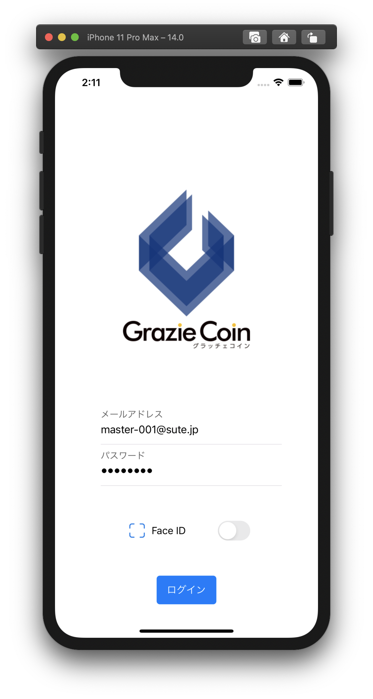

1. GrazieCoin(Web)でお使いのID/パスワードでログインできます。
1. 以下の条件を満たす場合、スイッチをONにすることで次回以降のログイン時に生体認証を利用できます
    - ✅ ご利用のスマートフォンに生体認証機能がある
    - ✅ 生体認証機能を有効化している

- 対応している生体認証
  - iOS : Face ID, Touch IDが利用できます
  - Android : 指紋認証、顔認証が利用できます
    - 画面上のラベルは「指紋認証」「顔認証」と表示されます

### Home
ご利用中のユーザの情報を表示する画面です。ログイン後に最初に表示されます。

#### 画面項目
- ユーザ情報
  - メールアドレス、ユーザ名、所属、プロフィール画像を表示します。
- ポイント・コイン残高
  - 現在のグラッチェポイント、グラッチェコイン残高を表示します。
- 直近5件の取引履歴
  - 自分が送った/受け取ったグラッチェまたはコインの履歴を表示します。

#### プロフィール画像の変更
  - カメラアイコンをタップし、画像を選択することでプロフィール画像を変更できます。
  - アイコンタップ時に「写真」へのアクセスを許可するか確認するダイアログが表示されますが「許可」をしてください

#### グラッチェを送る(メッセージ入力)画面へ移動　
  - グラッチェの直近5件の取引履歴に表示されているユーザをタップすると、表示されているユーザにグラッチェすることができます

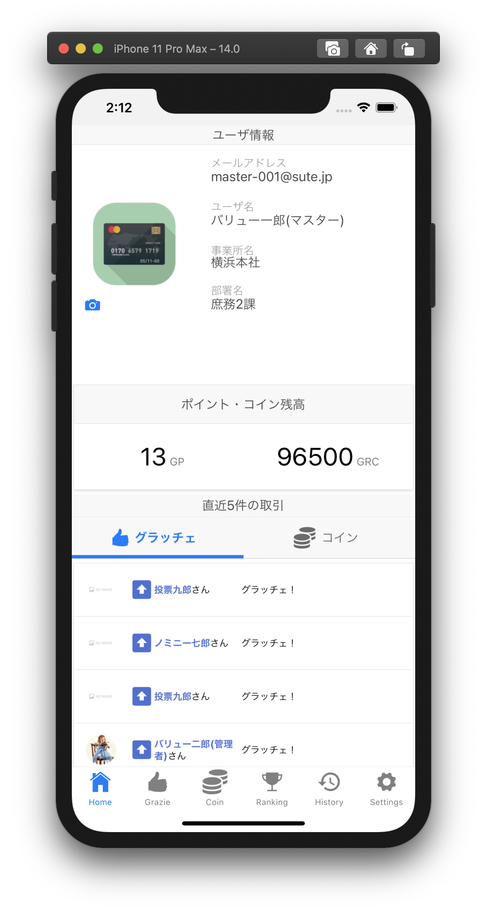

### Grazie
グラッチェを送る画面です。

#### グラッチェを送る(簡易)
1. グラッチェを送りたいユーザを選択します。
   - ユーザ名、事業所、部署を指定することで、ユーザを絞り込めます。 
   - ※サービス契約区分が会社の場合は「事業所」「部署」は表示されません
2. ユーザ名の右側に表示される 👍 ボタンをタップするとグラッチェを送ります。
   - この場合、デフォルトメッセージでグラッチェが送られます。
   - デフォルトメッセージはSettingsタブ内から変更することができます。 

#### グラッチェを送る(メッセージ入力)
👍 ボタンを長押しすると、メッセージを入力してからグラッチェを送ることができます。

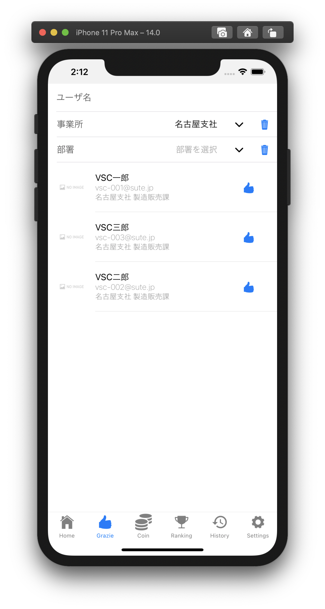
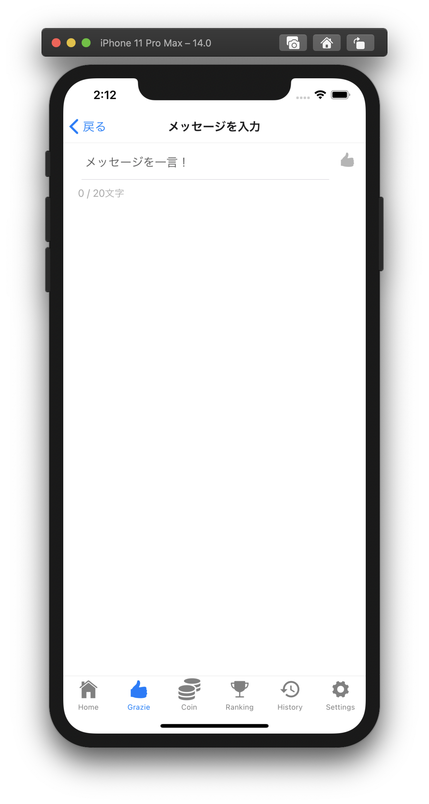

### Coin
グラッチェコインの送金や、商品を交換する画面です。

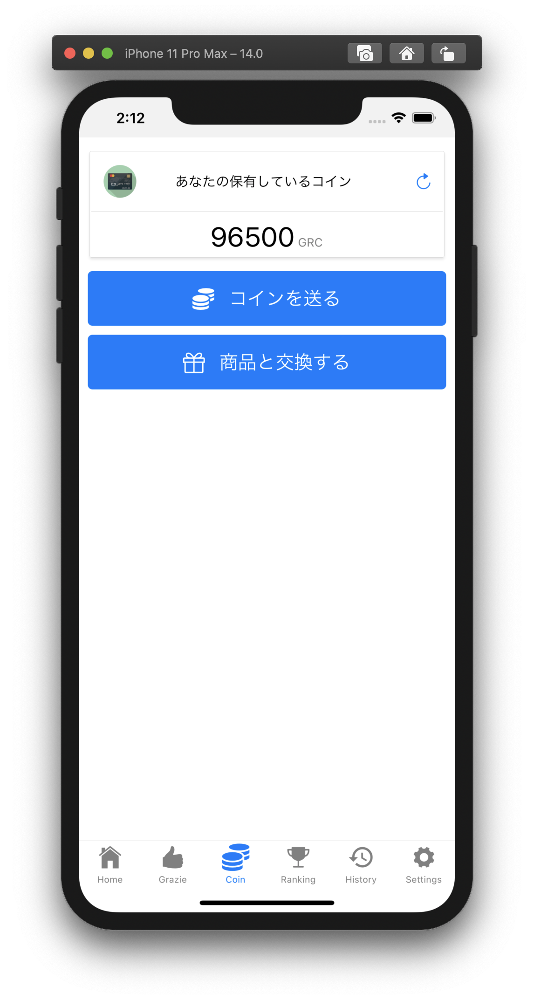

#### 画面項目

- コイン残高
  -  更新ボタンを押すと最新の残高を取得します。
- 「コインを送る」ボタン
  - コイン送金先選択画面へ移動します。
- 「商品と交換する」ボタン
  - 商品選択画面へ移動します。

#### コイン送金先選択画面

1. コインを送りたいユーザを選択します。
   - ユーザ名、事業所、部署を指定することで、ユーザを絞り込めます。 
   - ※サービス契約区分が会社の場合は「事業所」「部署」は表示されません
1. コインアイコンをタップすると、送金金額を入力する画面に移動します。

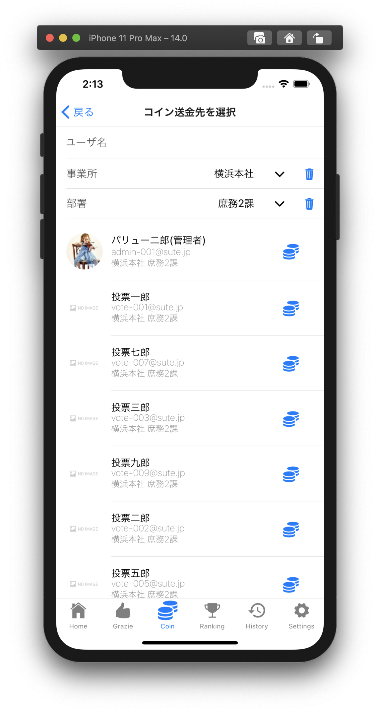
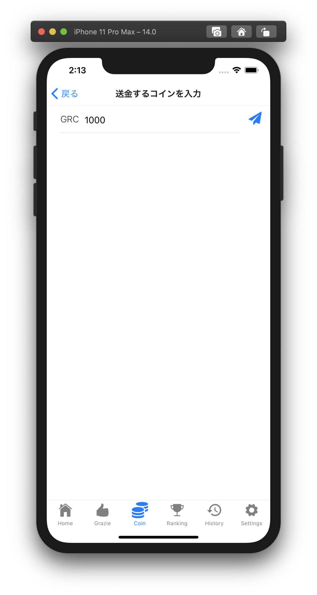

#### 商品選択画面
交換したい商品を選択する画面です。
「交換」ボタンをタップすると商品を交換できます。
残高不足で交換できない商品は、ボタンが「残高不足」と表示されます。

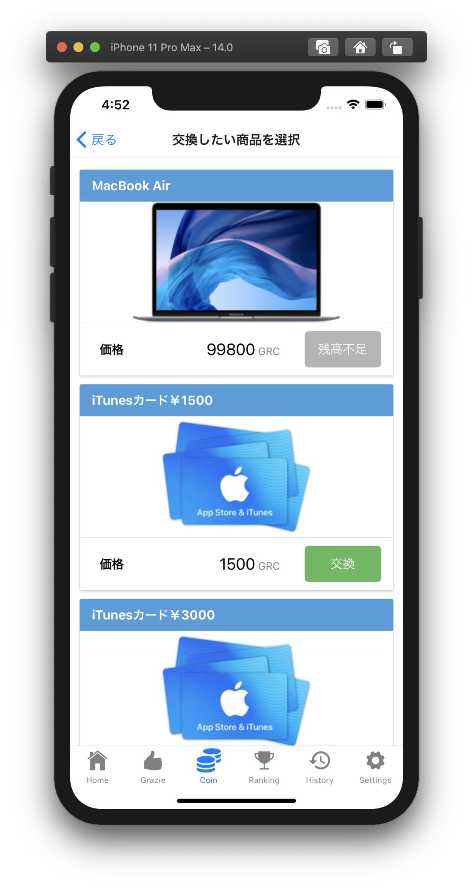

### Ranking
過去の集計結果、その日のグラッチェをした/されたユーザをランキング形式で表示する画面です。
グラッチェ集計の表彰ランキングと、サービス利用開始から通算のランキングと、1日ごとのランキングを表示します。
タブを切り替えるとサービスを利用する組織全体や事業所ごとの表示になります。
※サービス契約区分が会社の場合は「事業所」タブは表示されません

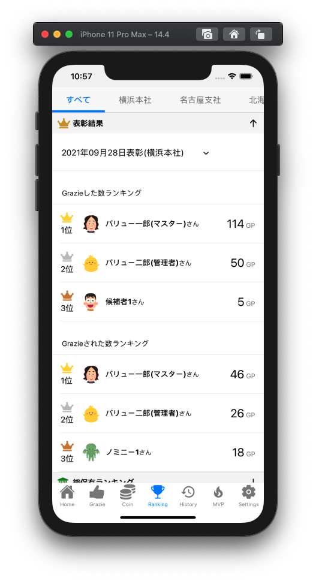
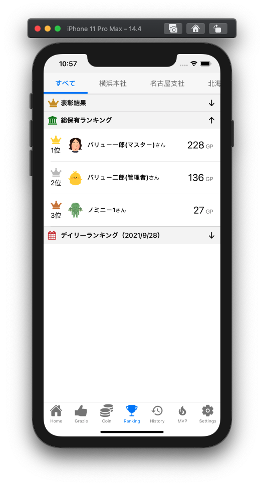
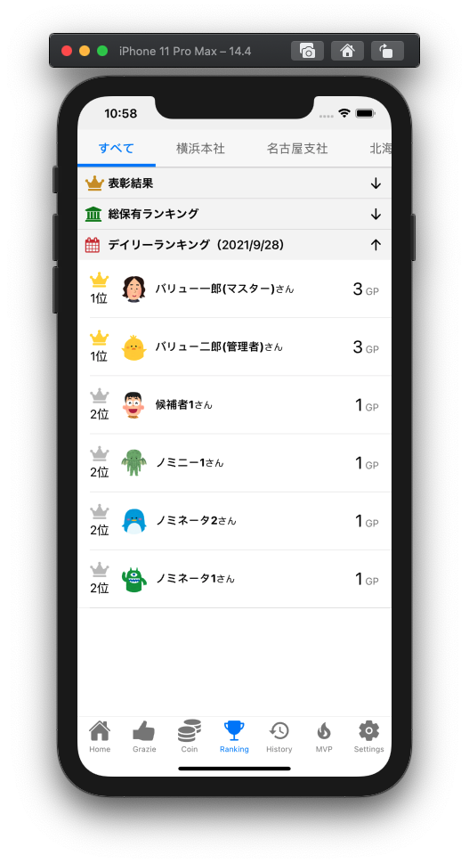
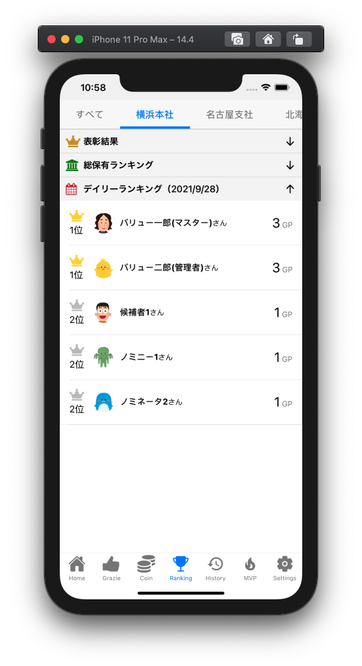
### History
組織全体のグラッチェやコイン送金、商品交換の履歴を表示する画面です。

#### グラッチェ
グラッチェの履歴を表示します。
自分宛や自分が送ったメッセージ履歴は、**ユーザ名や吹き出しが緑色**で表示されます。

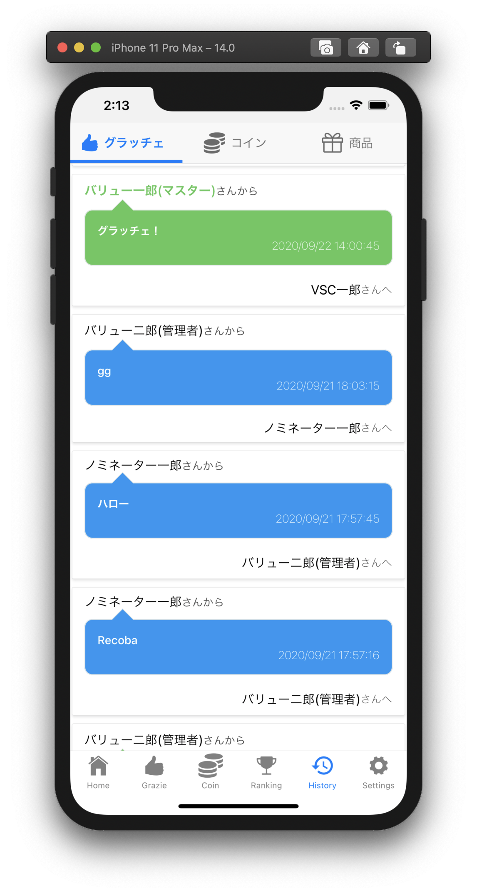

#### コイン
コインの送金履歴を表示します。
自分宛や自分が送ったコイン履歴は、**ユーザ名が緑色**で表示されます。
また、送金履歴には以下の種別があります。

- 送金
  - ユーザ間の送金を表します。
- 表彰
  - 管理者からユーザへの送金を表します。
- 回収
  - ユーザが管理者からコインを回収されたことを表します。
- 拠点間送金
  - 事業所から事業所への送金を表します。
- 予算付与
  - GrazieCoinサービスから組織へのコイン送金を表します。

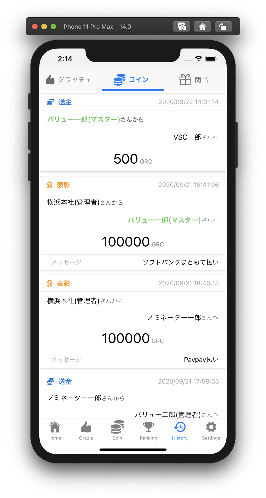

#### 商品
商品の交換履歴を表示します。
自分が交換した履歴は、**ユーザ名が緑色**で表示されます。

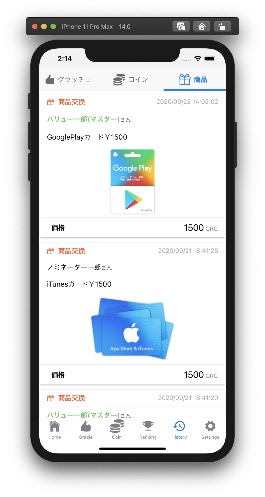

### Settings

通知設定やグラッチェのデフォルトメッセージを変更することができます。
不具合やお問合せ、アプリの使い方(ヘルプページ)へのリンクがあります。

#### 通知設定
グラッチェやコインを受け取った際に、メールやプッシュで通知を受け取るか設定できます。
また、アプリから定期的に届く通知を受け取るかの設定をすることができます

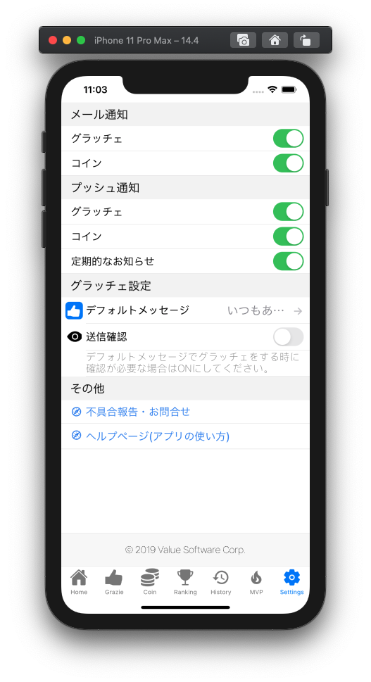

#### グラッチェメッセージ変更
Grazie画面でユーザ名の右隣に表示される👍ボタンをタップした際のデフォルトメッセージを変更できます。

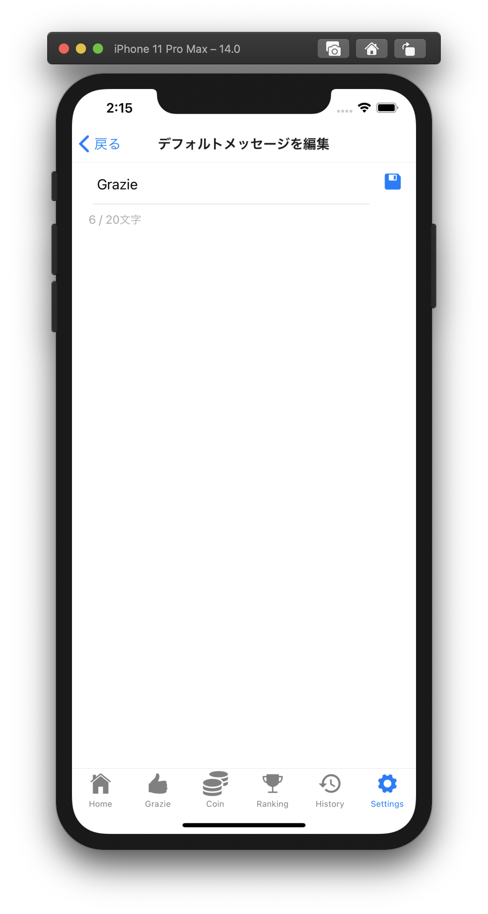

